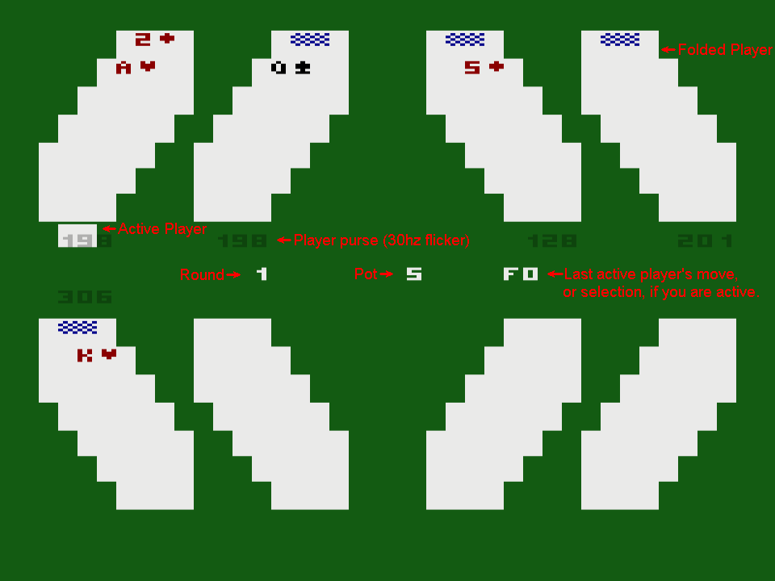

# PlusROM 5 Card Stud Client/Backend

This is an implimentation of a PlusROM client and backend for the FujiNet "5 Card Stud" server. It demonstrates using PlusROM and its backend to connect to the FujiNet lobby and parse JSON to communicate with the 5 Card Server. It should run on any PlusROM capable device or emulator.

The client is wrapped into a batari basic project with a custom kernel, similar to the brilliant Philip Blackman's [@splendidnut](https://forums.atariage.com/profile/42568-splendidnut/) [Bruce Lee demo](https://forums.atariage.com/topic/361350-brucelee-2600-rough-demo-in-bataribasic/).

The title screen music is done with the awesome [Miditari](https://forums.atariage.com/topic/297927-miditari-midi-to-tia-converter-tool).

## Manual
The ROM only works on devices or emulators that support PlusROM functions, otherwise you get a "(+) offline" icon and no "press fire" to start button at the title screen.

The Lobby is the real FujiNet lobby filtered for 5 Card Stud games, that have free seats on the table. You can select any table in the lobby you want, the request for the table gets send to the PlusROM backend and stored in the session there.

After you have selected a table your screen should look like this:

The cards on the top left of the screen are your cards. The table state automaticaly refreshes every 4 seconds. When it is your turn you can select with joystick up and down from the available moves and press fire to select the displayed move. Currently the refresh request resets the selected move to the first valid one. 

The bots take up to 3 seconds to do a move, if the ROM reloads earlier you might not get an active player in the JSON from the 5CS server.
Round 5 is not an "active" round. It is only to shows the hands of every player.

You can always leave the table to the title screen with the console "RESET" switch or to the Lobby with the "SELECT" switch. For couch complience the table can also be left to the lobby by moving the joystick to the right and pressing fire.

## To-Do's
- Fix postioning (of the last row)
- Fix color changes
- Fix/read table_leave response.
- Make refresh not reset selected move, when it is players turn.
- Amounts of cards
  

## Links
AtariAge forum: https://forums.atariage.com/topic/359421-fujinet-for-atari-2600/
FujiNet discord: https://discord.com/channels/655893677146636301/1194775662628704287
2600 wizards forum: https://woodgrain.taswegian.com/index.php?topic=74.0
